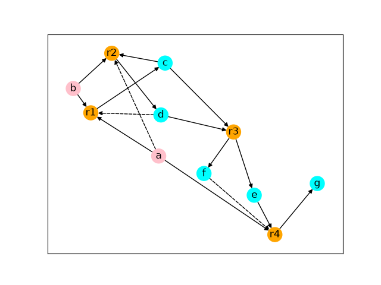
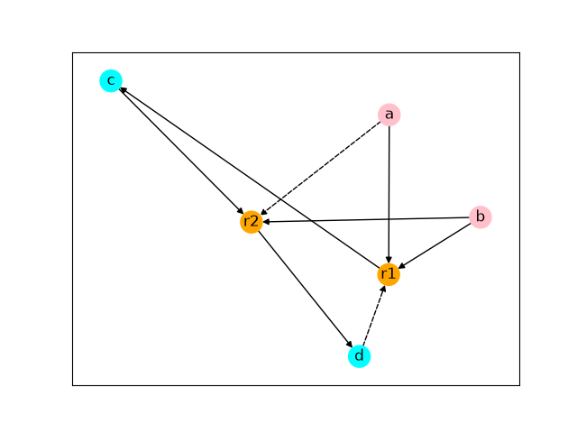
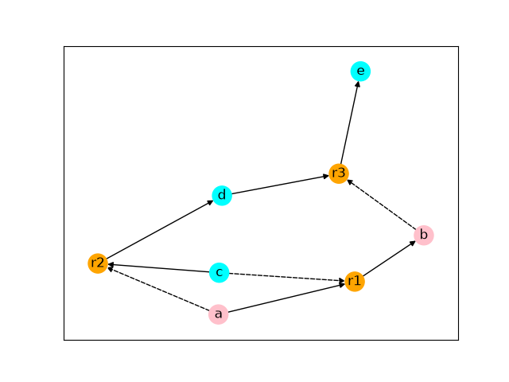
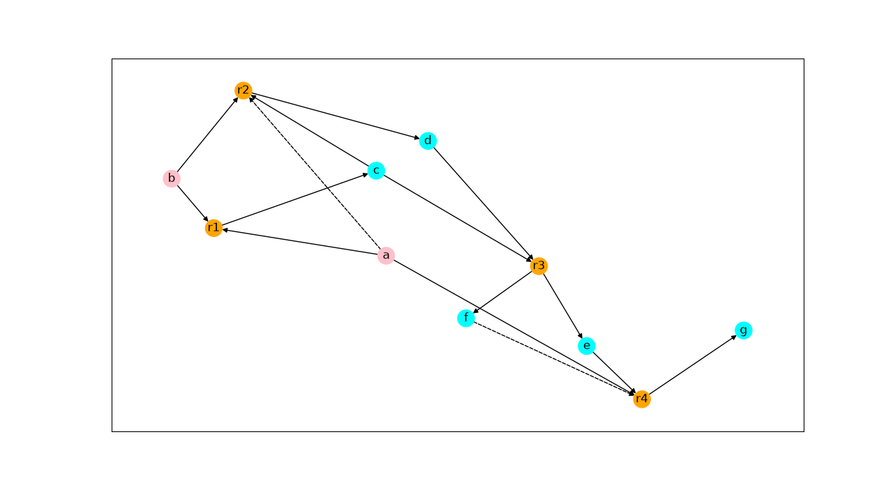
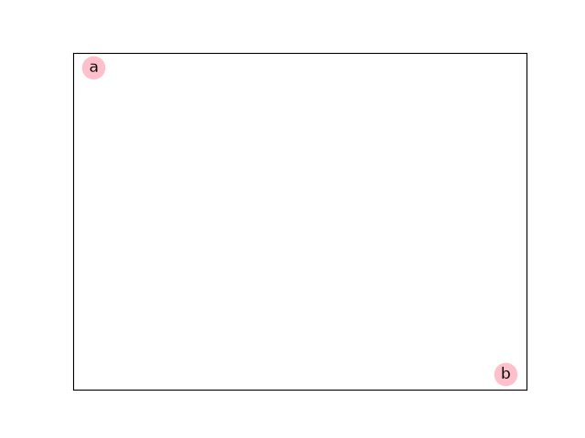

# RAF Detection Algorithm

## 1. What is RAF?
* **Background**: RAF was proposed as a mathematically rigorous model in the field of the origin of life, considering a network formed by a group of molecules that catalyze reactions within the system rather than individual specific molecules.
* **Definition**: RAF sets are defined as sets in which all of the reactions are catalyzed by at least one molecule involved in the reactions (RA) and all of the molecules can be generated through reaction pathways starting from molecules in the food set (F-generated).

---

## 2. Theory
* **Catalytic Reaction System (CRS)**:
    * Molecule set: X
    * Reaction set: R
    * Catalysis relations: C
    * Food set: F
* **Reflexively Autocatalytic (RA)**: A subset of reactions R' is RA if every reaction in R' is catalyzed by at least one molecule involved in R'.
* **F-generated**: All reactants and products in R' can be generated from the food set.
* **Maximal RAF (maxRAF)**: Maximal RAF is the set of reactions that remains after iteratively removing reactions that are either not catalyzed by any molecule involved in the reactions or cannot be reached from the food set.

---

## 3. Data Structures
* **Reactions**: An immutable dataclass representing a chemical reaction, defined by a reaction name and order-independent sets (frozenset) of reactant and product molecules.
* **Catalysis Relations**: A set of (catalyst, reaction) tuples.
* **Bipartite Graph Representation**:
    * Molecules and reactions are represented as two disjoint types of nodes in a directed bipartite graph.
    * Reactant edges point from molecules to reactions, while product edges point from reactions to molecules.
    * Catalysis relations are represented by dashed edges from catalyst molecules to the corresponding reactions.

---

## 4. Algorithm
* **Subroutines**:
    1. `reduce_to_RA()`: Remove reactions that are not catalyzed by any molecule involved in reactions in a set.
    2. `compute_closure()`: Compute molecules that can be obtained starting from the food set.
    3. `reduce_to_F_generated()`: Remove reactions in which at least one reactant cannot be obtained from the food set.
* **Main Loop & Termination**: Iterate `reduce_to_RA()`, `compute_closure()`, and `reduce_to_F_generated()` until there are no reactions in a set or no more reactions can be removed.

---

## 5. Implementation
* **Environment**: Python 3.13.0, `networkx` (v3.6.1), `matplotlib` (v3.11.1).
* **Script Organization**:
    * `Reaction`: Reaction data structure implemented as an immutable dataclass.
    * `initialize()`: Defines the food set, reactions, and catalysis relations, then runs the RAF reduction process.
    * `display_graph()`: Visualizes molecules, reactions, reactants, products, and catalysts using NetworkX and Matplotlib.
    * `reduce_to_RA()`: Removes reactions that have no available catalyst.
    * `compute_closure()`: Calculates all molecules that can be generated from the food set.
    * `reduce_to_F_generated()`: Removes reactions whose reactants cannot be generated from the food set.
    * `main()`: Entry point that calls `initialize()`.

---

## 6. Verification
### Case 1: Published Benchmark (Hordijk & Steel 2004, Fig. 1)
```python
# Definition of (F, R, C) from literature.
F = {"a", "b"}
r1 = Reaction(name="r1", reactants=frozenset(["a", "b"]), products=frozenset(["c"]))
r2 = Reaction(name="r2", reactants=frozenset(["b", "c"]), products=frozenset(["d"]))
r3 = Reaction(
    name="r3", reactants=frozenset(["c", "d"]), products=frozenset(["e", "f"])
)
r4 = Reaction(name="r4", reactants=frozenset(["a", "e"]), products=frozenset(["g"]))
R = {r1, r2, r3, r4}
C = {("d", r1), ("a", r2), ("f", r4)}
```

### Case 2: Non-RAF System (F-generated Failure)
```python
# Autocatalytic loop isolated from the food set.
F = {"a", "b"}
r1 = Reaction(name="r1", reactants=frozenset(["a"]), products=frozenset(["b"]))
r2 = Reaction(name="r2", reactants=frozenset(["c"]), products=frozenset(["d"]))
r3 = Reaction(name="r3", reactants=frozenset(["d"]), products=frozenset(["e"]))
R = {r1, r2, r3}
C = {("c", r1), ("a", r2), ("b", r3)}
```

### Case 3: Perturbation (Catalyst Deletion)
```python
# Benchmark network with a catalyst removed.
F = {"a", "b"}
r1 = Reaction(name="r1", reactants=frozenset(["a", "b"]), products=frozenset(["c"]))
r2 = Reaction(name="r2", reactants=frozenset(["b", "c"]), products=frozenset(["d"]))
r3 = Reaction(
    name="r3", reactants=frozenset(["c", "d"]), products=frozenset(["e", "f"])
)
r4 = Reaction(name="r4", reactants=frozenset(["a", "e"]), products=frozenset(["g"]))
R = {r1, r2, r3, r4}
C = {("a", r2), ("f", r4)}
```

---

## 7. Results

### Case 1: Published Benchmark
* **Detected maxRAF**: $\{r1, r2\}$ (2 reactions, 4 molecules)
* **Analysis**:
    * Because reaction $r3$ has no catalysts, it is eliminated during the first `reduce_to_RA()` step.
    * Without $r3$, molecule $e$ cannot be produced, so the closure of the food set expands only to $W = \{a, b, c, d\}$.
    * In `reduce_to_F_generated()`, reaction $r4$ is removed because its reactant ($e$) is not in $W$.
    * Because the remaining set $\{r1, r2\}$ satisfies both RA and F-generated, this is a maxRAF set.
* **Visualizations**:

|  |  |
| :---: | :---: |
| Initial Reaction Network | Extracted maxRAF Subgraph |

### Case 2: Non-RAF System
* **Detected maxRAF**: Empty set
* **Analysis**: 
    * Although all reactions in the initial set satisfy the Reflexively Autocatalytic (RA) condition, reactants $(c, d)$ of $r2$ and $r3$ cannot be produced from the food set $F = \{a, b\}$.
    * Therefore, in `reduce_to_F_generated()`, reactions $r2$ and $r3$ are removed.
    * In `reduce_to_RA()`, because molecule $c$ is neither a reactant nor a product in the remaining reaction $r1$, reaction $r1$ loses its catalyst and is removed.
    * At this point, all reactions are removed.
* **Visualizations**:

|  |  |
| :---: | :---: |
| Initial Reaction Network | Extracted maxRAF Subgraph |

### Case 3: Perturbation (Catalyst Deletion)
* **Detected maxRAF**: Empty set
* **Analysis**: 
    * Because $r1$ and $r3$ have no catalysts, they are removed during the first `reduce_to_RA()` step.
    * Since $r1$ and $r3$ are removed and the products $c$, $e$, and $f$ cannot be produced, `compute_closure()` computes the closure of the food set as $W = \{a, b\}$.
    * In `reduce_to_F_generated()`, $r2$ and $r4$ are removed because their reactants $c$ and $e$ are not in the closure $W$. 
    * All reactions are removed, so this set becomes empty.
* **Visualizations**:

|  |  |
| :---: | :---: |
| Initial Reaction Network | Extracted maxRAF Subgraph |

---

## 8. Limitations
* **Computational Complexity**: This algorithm runs in polynomial time. However, because the worst-case time complexity is $O(|X||R|^3)$, the current implementation is intended for small reaction networks.
* **Educational Purpose**: This project does not propose a new algorithm. It was implemented primarily for learning and verifying the fundamental logic of the RAF algorithm. Therefore, it may lack comprehensive comments and contain some messy code.
* **Out of Scope**: This is a topological model and does not account for kinetic aspects such as reaction rates and molecular concentrations. Moreover, this does not include molecules that inhibit reactions.

